# DIALOGUE NATIONAL
## Guide d'utilisation de la plateforme

**dialoguenational.cd**

Version : 1.0
Date : 16 septembre 2026

---

### À qui s'adresse ce guide

Ce guide couvre les deux usages de la plateforme :

- **Partie A — Déposer une contribution.** Destinée aux citoyens, aux relais associatifs et aux
  agents qui accompagnent le public. Elle décrit pas à pas le dépôt d'une proposition.
- **Partie B — Traiter les contributions.** Destinée aux équipes habilitées qui reçoivent,
  classent et synthétisent les contributions dans l'espace d'administration.

**Les captures d'écran de ce guide présentent des données de démonstration.** Les noms,
contributions et statistiques qui y figurent ont été créés pour illustrer le fonctionnement de
l'outil ; ils ne correspondent à aucune contribution réelle.

### Les deux espaces en un coup d'œil

| | Site public | Espace d'administration |
|---|---|---|
| Adresse | `dialoguenational.cd` | `dialoguenational.cd/admin` |
| Qui y accède | Tout le monde | Comptes habilités uniquement |
| Compte nécessaire | Non | Oui |
| Ce qu'on y fait | Lire la démarche, déposer une contribution | Consulter, classer, annoter, synthétiser |

---

# PARTIE A — DÉPOSER UNE CONTRIBUTION

## A1. La page d'accueil

*À quoi ça sert :* comprendre la démarche avant de contribuer, et accéder au formulaire.

La page présente le Dialogue national, les quinze thématiques ouvertes, les documents officiels
publiés et le bouton de dépôt. Le bouton **« Déposer une contribution »** est présent en haut de
page et se retrouve à plusieurs endroits du parcours.

## A2. L'assistant guidé

*À quoi ça sert :* aider une personne qui hésite sur la manière de formuler sa proposition.

L'assistant pose **cinq questions à choix multiples** et propose, à la fin, d'ouvrir le formulaire
avec la thématique déjà sélectionnée. Il ne rédige rien à votre place et n'enregistre rien tant que
vous n'avez pas envoyé le formulaire.

*Comment faire :*

1. Cliquer sur **« Besoin d'aide ? »**, en bas à droite de la page d'accueil.
2. Répondre aux cinq questions ; le bouton « Retour » permet de corriger une réponse.
3. Cliquer sur le bouton de dépôt proposé à la dernière étape.

## A3. Comprendre le parcours avant de déposer

*À quoi ça sert :* savoir ce qui se passe après l'envoi.

Le lien **« Voir comment ça se passe »** ouvre une fenêtre qui récapitule les quatre étapes du dépôt
puis les six étapes du traitement, de la réception au pacte national.

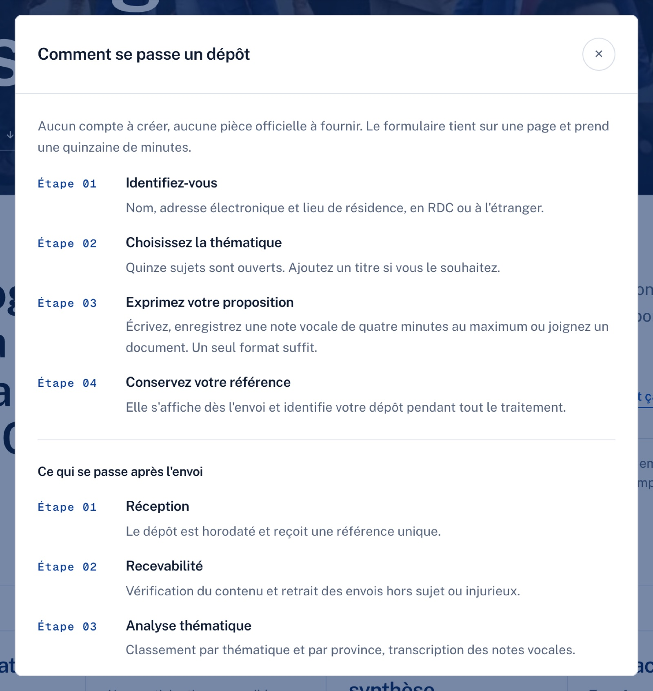

## A4. Choisir sa thématique

*À quoi ça sert :* rattacher la proposition au bon sujet, ce qui conditionne son analyse.

Quinze thématiques sont ouvertes. **Une contribution par thématique** : si votre proposition touche
deux sujets, déposez deux contributions distinctes.

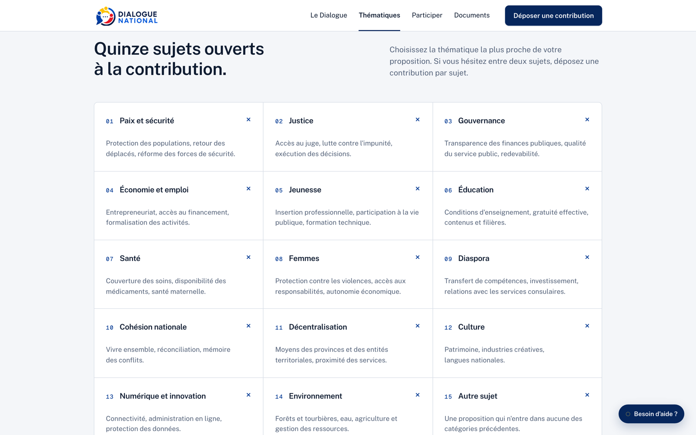

## A5. Étape 1 — Vos informations

*À quoi ça sert :* permettre le traitement de la contribution et, si nécessaire, une demande de
précision. Ces informations ne sont pas publiées.

*Comment faire :*

1. Renseigner **prénom**, **nom** et **adresse électronique** — les trois sont obligatoires.
2. Le téléphone est facultatif.
3. Choisir le **pays de résidence** : commencer à taper le nom du pays et le sélectionner dans la
   liste. Le champ affiche le drapeau du pays retenu.
4. Indiquer la **ville ou le territoire**.
5. Si le pays est la République démocratique du Congo, un champ **province** apparaît.
6. Indiquer, si vous le souhaitez, en quelle qualité vous contribuez : citoyen, diaspora, société
   civile, jeunesse, expert, autorité coutumière, confession religieuse…

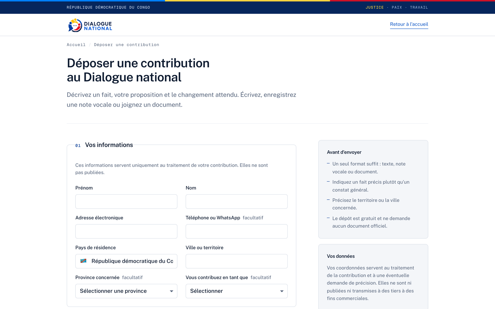

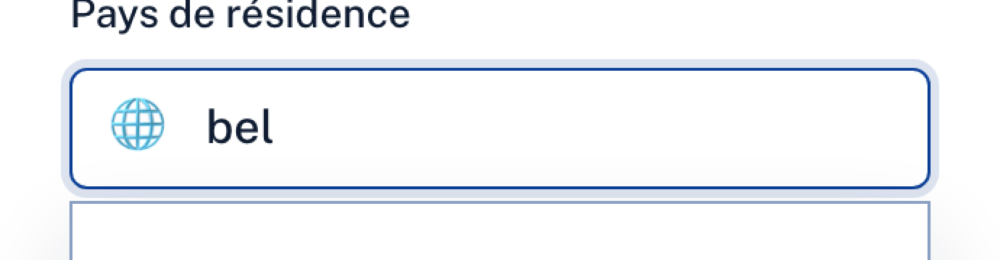

## A6. Étape 2 — Objet de la contribution

*À quoi ça sert :* classer la proposition et lui donner un intitulé reconnaissable.

1. Choisir la **thématique** (obligatoire).
2. Donner un **titre** court et précis (facultatif mais recommandé). Un bon titre nomme le problème
   et le lieu : « Chaîne du froid pour les vaccins à Walungu » vaut mieux que « Problème de santé ».

## A7. Étape 3 — Votre contribution

*À quoi ça sert :* exprimer la proposition dans le format qui convient le mieux au contributeur.

**Un seul des trois formats suffit.** Ils peuvent aussi être combinés : un texte court accompagné
d'un document, par exemple.

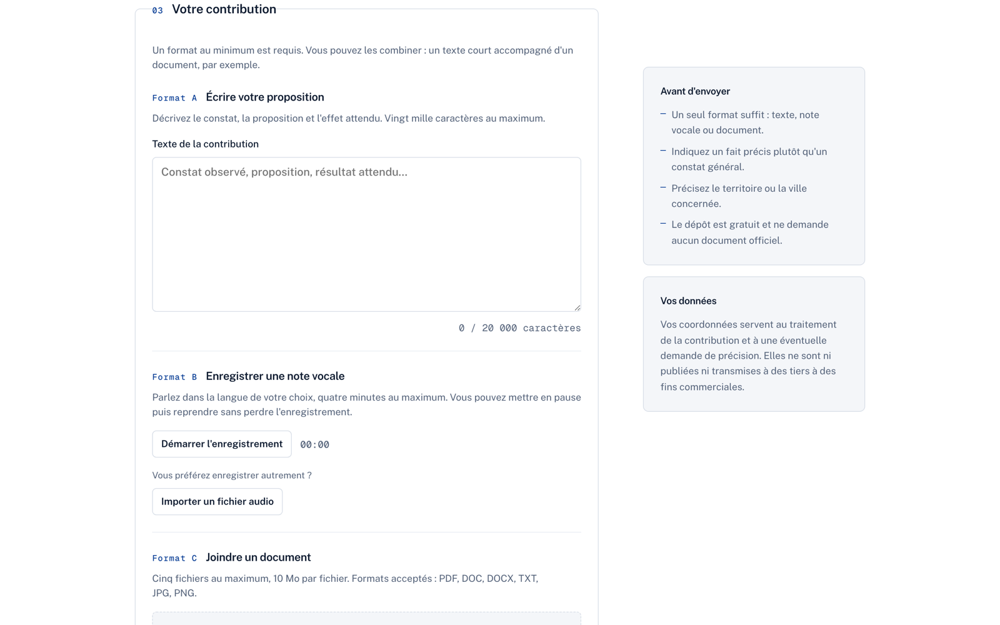

### Format A — Écrire

Jusqu'à 20 000 caractères. Le compteur sous le champ indique ce qui reste. Une contribution utile
décrit trois choses : **ce que vous observez**, **ce que vous proposez**, **ce que cela changerait**.

### Format B — Enregistrer une note vocale

Jusqu'à **4 minutes**, dans la langue de votre choix. C'est le format à privilégier pour qui n'a pas
l'habitude d'écrire.

*Comment faire :*

1. Cliquer sur **« Démarrer l'enregistrement »**.
2. Autoriser le microphone lorsque le navigateur le demande.
3. Vérifier que la jauge **« Niveau du micro »** bouge quand vous parlez : c'est la preuve que le son
   est capté.
4. **« Mettre en pause »** puis reprendre est possible ; les pauses ne comptent pas dans les
   4 minutes.
5. Cliquer sur **« Terminer »**.

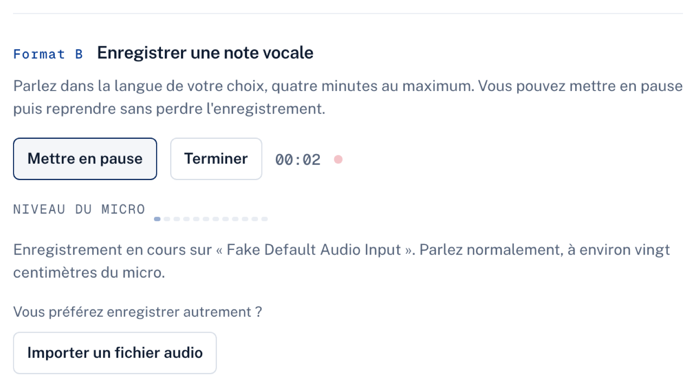

6. **Réécouter** la note avec le lecteur qui apparaît. Si elle ne convient pas, utiliser
   « Supprimer et recommencer ».

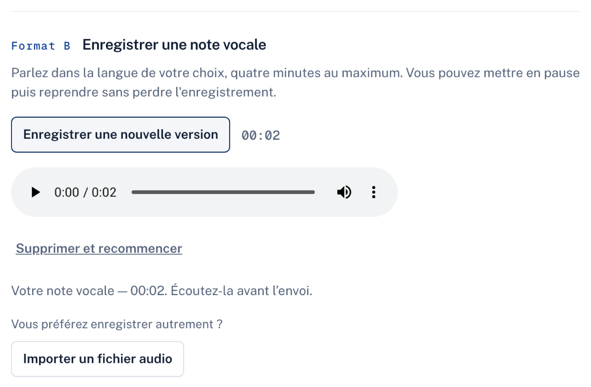

**Si l'enregistrement ne fonctionne pas :** un message d'aide précise la cause et la marche à
suivre. Les cas les plus fréquents :

| Message affiché | Que faire |
|---|---|
| Microphone non autorisé | Autoriser le microphone pour ce site dans les réglages du navigateur, puis « Réessayer » |
| Microphone introuvable | Brancher ou activer un microphone |
| Microphone indisponible | Fermer l'application qui l'utilise (un appel en cours, par exemple) |
| Accès sécurisé requis | Ouvrir la page directement en `https://`, hors navigation privée |
| La note enregistrée est silencieuse | L'entrée micro est coupée ou mal sélectionnée dans les réglages de l'appareil |

En dernier recours, un **fichier audio** enregistré avec l'application du téléphone peut être envoyé
à la place, dans la même limite de 4 minutes.

### Format C — Joindre un document

Jusqu'à **5 fichiers de 10 Mo chacun**, aux formats PDF, DOC, DOCX, TXT, JPG et PNG. Une
photographie d'un texte manuscrit est acceptée.

*Comment faire :* cliquer sur « Choisir des fichiers », ou faire glisser les fichiers dans le cadre.
Chaque fichier ajouté apparaît dans une liste, avec un bouton pour le retirer.

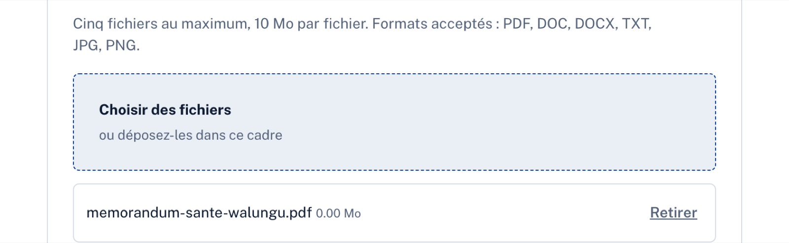

## A8. Consentement et envoi

La case de consentement est **obligatoire**. Elle indique que la contribution est collectée et
traitée dans le cadre du Dialogue national, qu'elle n'est pas publiée automatiquement, et que les
extraits repris dans les synthèses sont anonymisés.

Cliquer ensuite sur **« Envoyer ma contribution »**.

## A9. Si le formulaire refuse l'envoi

Les champs incomplets sont signalés un par un, et un message récapitulatif apparaît au-dessus du
bouton d'envoi. La page ne perd rien : ce qui a déjà été saisi, y compris la note vocale, reste en
place.

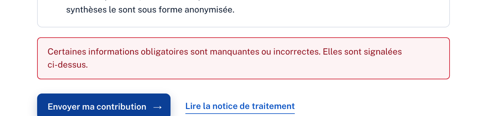

| Message | Cause |
|---|---|
| Certaines informations obligatoires sont manquantes ou incorrectes | Un champ obligatoire est vide ou l'adresse électronique est mal formée |
| Ajoutez au moins un format | Ni texte, ni note vocale, ni document |
| Vous devez accepter le traitement de votre contribution | La case de consentement n'est pas cochée |
| Le format de *ce fichier* n'est pas accepté | Le fichier n'est ni PDF, DOC, DOCX, TXT, JPG ni PNG |
| Chaque fichier doit rester sous 10 Mo | Fichier trop volumineux |
| Trop de tentatives depuis cet appareil | Plus de dix envois en un quart d'heure depuis la même connexion |

## A10. La référence de dépôt

Après l'envoi, une **référence** de la forme `DIALOGUE-2026-000130` s'affiche.

**Elle doit être conservée** : c'est la seule preuve de dépôt, et elle est demandée pour toute
question ultérieure sur la contribution, y compris pour en demander la suppression. Aucun courriel
de confirmation n'est envoyé.

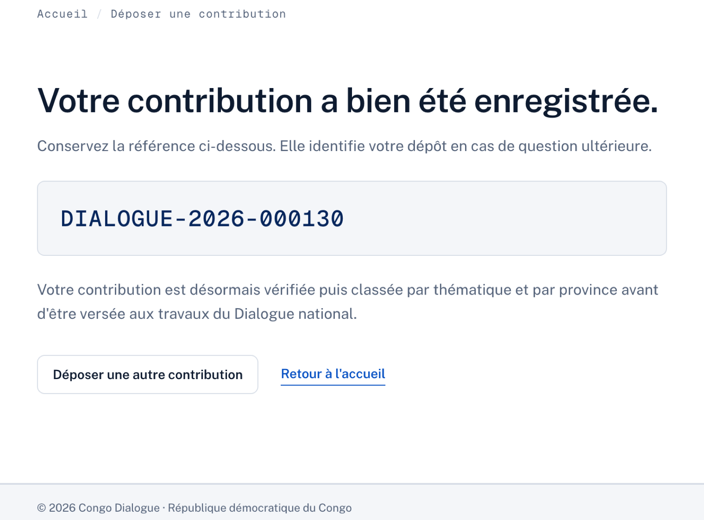

## A11. Sur téléphone

Le site est conçu pour être utilisé sur mobile, y compris sur une connexion lente. Le menu se
déplie par le bouton « Menu », et le formulaire s'affiche en une seule colonne. Le texte seul suffit
à valider un dépôt : ni photo ni fichier ne sont nécessaires.

 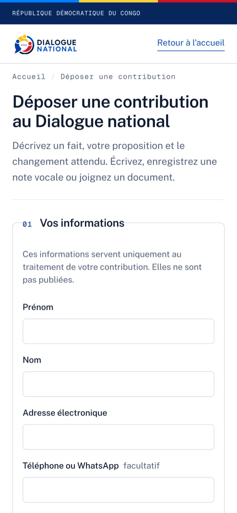

---

# PARTIE B — TRAITER LES CONTRIBUTIONS

## B1. Se connecter

*Adresse :* `dialoguenational.cd/admin`

*Comment faire :* saisir l'adresse électronique et le mot de passe fournis par l'administrateur de
la plateforme, puis « Se connecter ». Le bouton « Afficher » permet de vérifier le mot de passe saisi.

La session dure **12 heures**, après quoi une reconnexion est demandée. Au bout de **cinq tentatives
échouées en un quart d'heure**, les connexions sont temporairement bloquées depuis cette connexion
internet.

Il n'existe pas de fonction « mot de passe oublié » : en cas d'oubli, un super administrateur
réattribue un mot de passe provisoire depuis l'écran « Utilisateurs ».

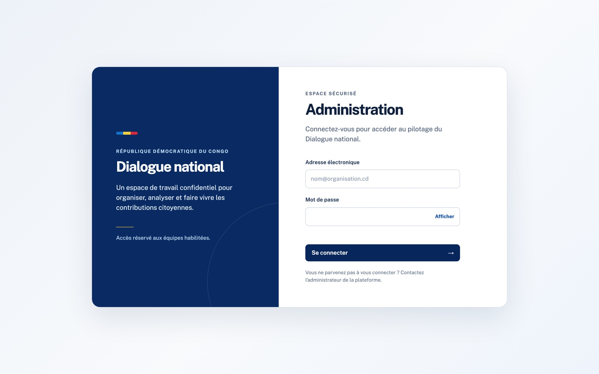

## B2. Les rôles : qui peut faire quoi

Chaque compte porte un rôle qui détermine ce qu'il peut faire. Le rôle est vérifié par le serveur :
ce qui n'est pas permis n'est pas seulement caché, il est refusé.

| | Lecture seule | Analyste | Administrateur | Super administrateur |
|---|---|---|---|---|
| Consulter les contributions | oui | oui | oui | oui |
| Modifier statut, priorité, affectation | — | oui | oui | oui |
| Écouter les notes, télécharger les documents | — | oui | oui | oui |
| Commenter, étiqueter | — | oui | oui | oui |
| Rédiger des synthèses | — | oui | oui | oui |
| Tableau de bord et analyses | — | — | oui | oui |
| Exporter en CSV | — | — | oui | oui |
| Gérer les comptes | — | — | — | oui |
| Journal d'audit | — | — | — | oui |

## B3. Le tableau de bord

*À quoi ça sert :* voir en un coup d'œil ce qui est arrivé et ce qui attend un traitement.

Les huit indicateurs du haut sont **cliquables** : un clic ouvre la liste des contributions déjà
filtrée. « Non consultées » et « À traiter » sont les deux points d'entrée du travail quotidien.

En dessous : les dépôts des trente derniers jours, la répartition par thématique, les derniers
dépôts reçus et les provinces les plus actives.

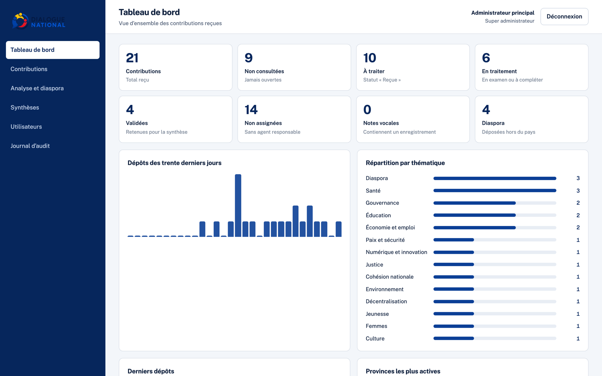

## B4. La liste des contributions et les filtres

*À quoi ça sert :* retrouver une contribution précise, ou constituer un lot de travail.

*Comment faire :*

1. **Rechercher** par référence, nom, adresse électronique ou contenu.
2. **Filtrer** par statut, thématique, pays, format, priorité, personne assignée, ou n'afficher que
   les contributions jamais consultées.
3. Cliquer sur **« Filtrer »** pour appliquer, sur **« Réinitialiser »** pour tout effacer.
4. **Trier** en cliquant sur les en-têtes Référence, Reçue le, Statut ou Priorité.
5. Se déplacer avec **« Précédente »** et **« Suivante »** ; le nombre total de résultats est affiché.

Les contributions jamais ouvertes portent un **liseré bleu** à gauche de la ligne.

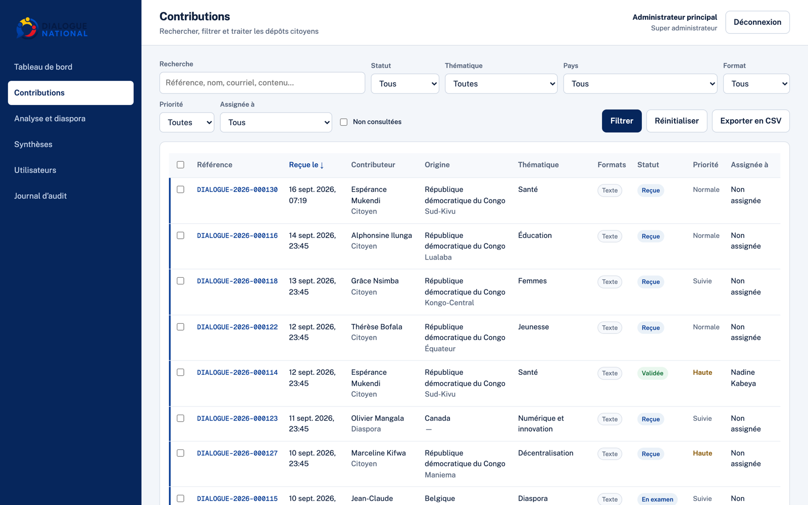

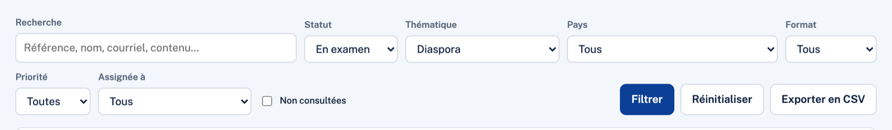

## B5. Traiter plusieurs contributions à la fois

*À quoi ça sert :* appliquer le même statut ou la même affectation à un lot, sans ouvrir chaque
fiche.

*Comment faire :*

1. Cocher les lignes concernées. La case de l'en-tête sélectionne toute la page.
2. Une barre apparaît, indiquant le nombre d'éléments sélectionnés.
3. Choisir un **statut**, une **affectation**, ou les deux.
4. Cliquer sur **« Appliquer »**.

Chaque modification est historisée individuellement, comme si elle avait été faite fiche par fiche.

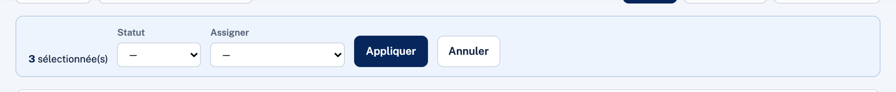

## B6. La fiche d'une contribution

*À quoi ça sert :* tout ce qui concerne un dépôt au même endroit.

On y trouve l'identité et les coordonnées du contributeur, son origine, la thématique, le titre, le
texte intégral, la note vocale, les documents joints, les commentaires internes et l'historique des
statuts.

**L'ouverture d'une fiche marque la contribution comme consultée** : elle disparaît alors du filtre
« Non consultées ».

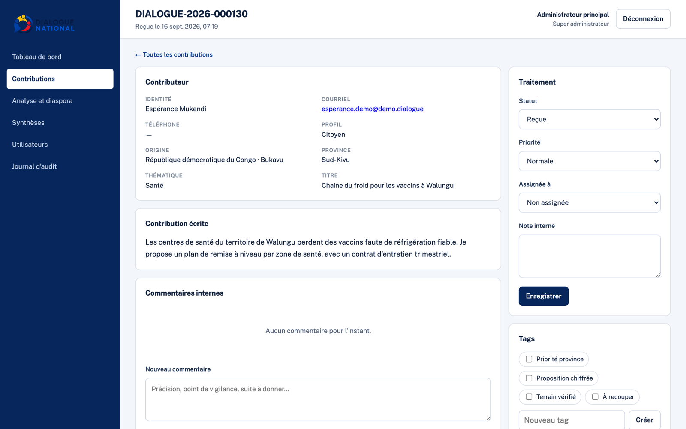

## B7. Statut, priorité, affectation et note interne

*À quoi ça sert :* faire avancer la contribution dans le circuit et désigner qui s'en occupe.

*Comment faire :* dans la colonne de droite,

1. choisir le **statut** parmi les huit disponibles ;
2. fixer la **priorité** : Normale, Suivie, Haute, Urgente ;
3. **affecter** la contribution à un agent ;
4. ajouter une **note interne** si nécessaire ;
5. cliquer sur **« Enregistrer »**.

Tout changement de statut est inscrit dans l'historique, avec son auteur et sa date.

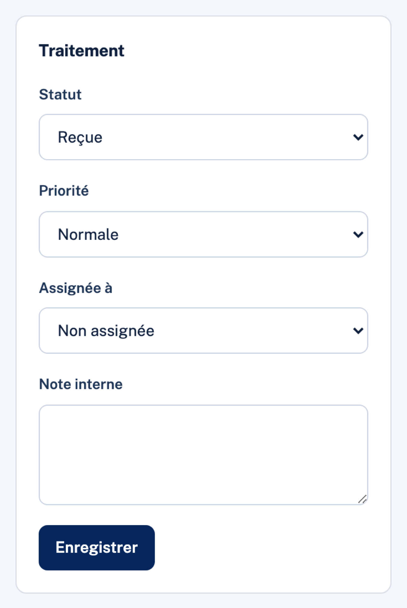

## B8. Commentaires internes

*À quoi ça sert :* échanger entre agents sur une contribution, sans modifier son contenu.

Les commentaires sont **internes** : ils ne sont jamais visibles du contributeur. Chacun est
horodaté et signé du compte qui l'a écrit.

*Comment faire :* saisir le texte dans le champ « Nouveau commentaire », puis « Enregistrer le
commentaire ».

## B9. Étiquettes

*À quoi ça sert :* marquer des contributions transversalement, au-delà de la thématique — par
exemple « Terrain vérifié » ou « Proposition chiffrée ».

*Comment faire :* cocher les étiquettes voulues dans la colonne de droite, puis « Enregistrer ». Une
nouvelle étiquette se crée directement depuis la fiche, en la saisissant sous la liste.

## B10. Écouter une note vocale, télécharger un document

*À quoi ça sert :* accéder au contenu déposé dans un format autre que le texte.

La note vocale se lit directement dans la fiche. Les documents se téléchargent par un clic sur leur
nom.

**Ces deux actions sont journalisées** : le journal d'audit conserve qui a écouté ou téléchargé quoi,
et quand. Les fichiers ne sont accessibles qu'aux comptes habilités — aucune adresse publique ne
permet d'y accéder.

Les champs **Transcription** et **Langue détectée** sont à saisir à la main : aucune transcription
automatique n'est en place.

## B11. Analyse et diaspora

*À quoi ça sert :* lire la participation par géographie et par sujet.

Le tableau de la diaspora donne, par pays, le nombre de contributions et le nombre de contributeurs
distincts. Le second bloc montre le poids relatif des thématiques.

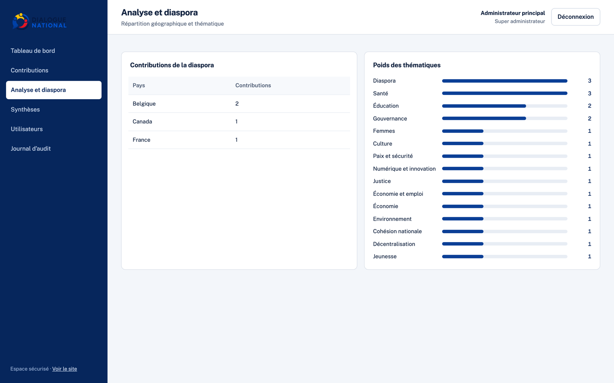

## B12. Synthèses

*À quoi ça sert :* rassembler plusieurs contributions convergentes en une note destinée aux travaux.

*Comment faire :*

1. Dans « Synthèses », renseigner un **titre**, une **thématique** et le **contenu**, puis
   « Créer la synthèse ».
2. Ouvrir la synthèse pour la modifier.
3. Faire évoluer son statut : **Brouillon → En relecture → Publiée**.

La synthèse est rédigée par un analyste. **Aucune génération automatique n'existe** : la plateforme
ne produit pas de texte à votre place.

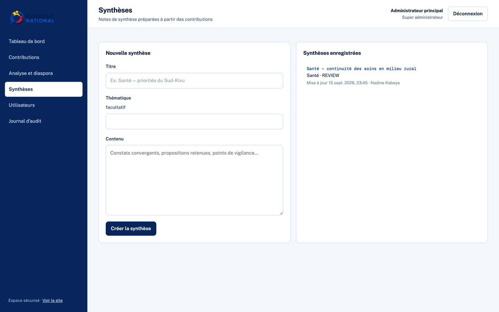

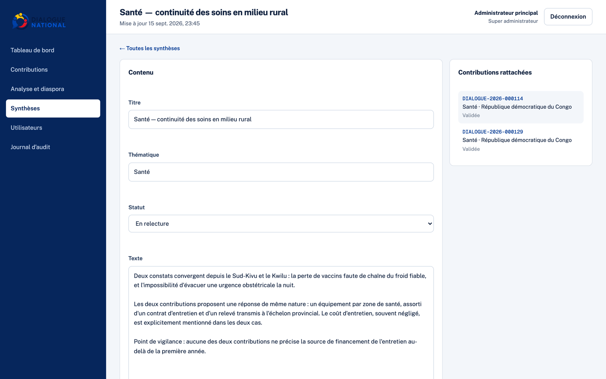

## B13. Comptes utilisateurs

*Réservé au super administrateur.*

*À quoi ça sert :* ouvrir, fermer et faire évoluer les accès.

*Comment faire :*

- **Créer un compte** : nom affiché, adresse électronique, rôle, et mot de passe provisoire d'au
  moins 16 caractères, à transmettre à la personne concernée par un canal sûr.
- **Changer un rôle** : le menu déroulant de la ligne applique le changement immédiatement.
- **Désactiver ou réactiver** : le bouton en fin de ligne. **Une désactivation ferme immédiatement
  les sessions ouvertes** du compte.

Un super administrateur ne peut ni se désactiver ni se rétrograder lui-même : la plateforme ne peut
pas se retrouver sans pilote.

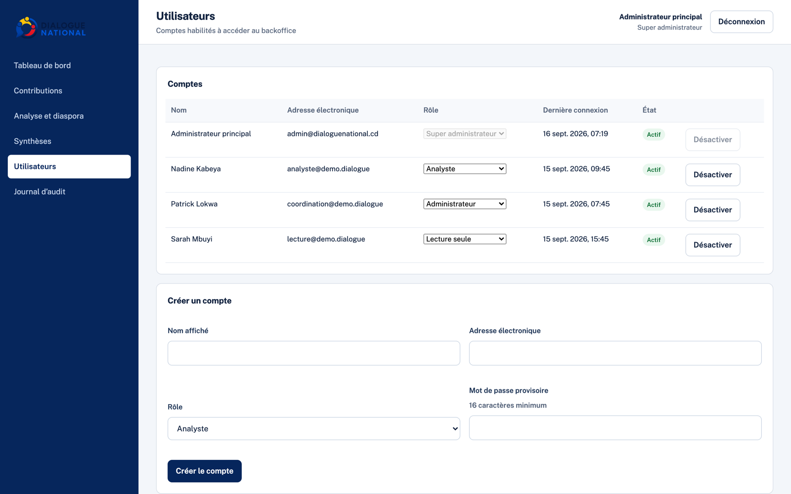

## B14. Journal d'audit

*Réservé au super administrateur.*

*À quoi ça sert :* savoir qui a fait quoi, et quand. C'est l'outil de contrôle en cas de doute sur
un accès ou une modification.

Quinze types d'actions sont enregistrés : connexions et échecs de connexion, modifications de
contributions, commentaires, étiquettes, écoutes de notes vocales, téléchargements de documents,
exports, synthèses et gestion des comptes.

Le filtre en haut de l'écran permet de n'afficher qu'un type d'action. L'adresse IP n'est pas
conservée en clair.

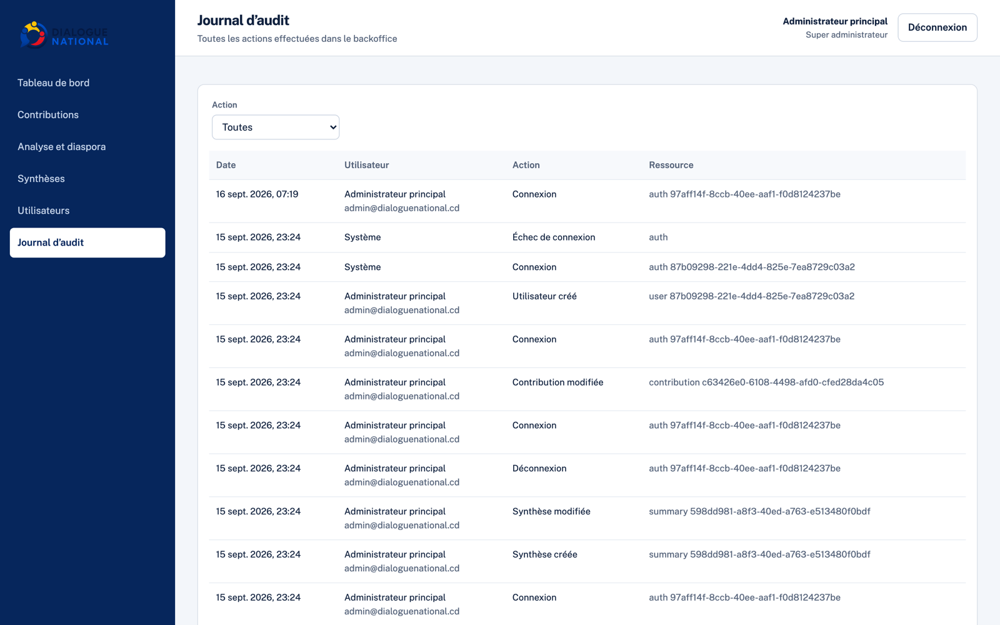

## B15. Exporter les contributions

*À quoi ça sert :* travailler les données dans un tableur.

*Comment faire :* appliquer d'abord les filtres voulus dans la liste, puis cliquer sur
**« Exporter en CSV »**. L'export **respecte les filtres actifs**.

Colonnes exportées : Référence, Date, Prénom, Nom, Email, Pays, Province, Profil, Thématique,
Statut, Priorité. Le fichier s'ouvre directement dans un tableur, accents compris.

**Attention :** l'export contient des données personnelles en clair. Sa diffusion doit être
maîtrisée. Chaque export est journalisé.

---

# PARTIE C — MÉMENTO

## C1. Les huit statuts

| Statut | Quand l'utiliser |
|---|---|
| **Reçue** | Statut initial : la contribution n'a pas encore été examinée |
| **En examen** | Un agent l'a prise en charge |
| **À compléter** | Une précision est nécessaire avant de décider |
| **Validée** | Retenue pour la synthèse |
| **Doublon** | Déjà reçue sous une autre référence |
| **Hors sujet** | En dehors du champ du Dialogue |
| **Rejetée** | Écartée : contenu irrecevable |
| **Archivée** | Traitement terminé |

## C2. Ordre de travail recommandé

1. Ouvrir le **tableau de bord** et regarder « Non consultées » et « À traiter ».
2. Filtrer la **liste** sur sa propre affectation, ou sur les contributions non assignées.
3. Ouvrir chaque fiche, lire ou écouter, passer le statut à **En examen**.
4. Classer : priorité, étiquettes, note interne, commentaire si un échange est nécessaire.
5. Décider : **Validée**, **À compléter**, **Doublon**, **Hors sujet** ou **Rejetée**.
6. Rattacher les contributions validées à une **synthèse** thématique.

## C3. Questions fréquentes

**Un contributeur peut-il modifier sa contribution ?**
Non. Il peut en déposer une nouvelle. La suppression se demande en indiquant la référence.

**Un contributeur reçoit-il une confirmation par courriel ?**
Non. Aucun envoi de courriel n'est en place. La référence affichée à l'écran est la seule preuve de
dépôt — c'est le point à rappeler systématiquement aux contributeurs.

**Les contributions sont-elles publiées ?**
Jamais automatiquement. Les extraits repris dans les synthèses sont anonymisés.

**Combien de contributions une personne peut-elle déposer ?**
Autant que nécessaire, de préférence une par thématique. La limite technique est de dix envois par
quart d'heure depuis une même connexion.

**Peut-on contribuer sans savoir écrire ?**
Oui : note vocale de 4 minutes, ou photographie d'un texte manuscrit.

**Dans quelles langues ?**
Français, lingala, swahili, kikongo, tshiluba. La note vocale est le format adapté pour les langues
nationales.

**Le dépôt est-il payant ?**
Non, et aucun agent n'est habilité à demander un paiement ou un document officiel pour déposer.

## C4. Limites à connaître

| Limite | Valeur |
|---|---|
| Texte | 20 000 caractères |
| Note vocale | 4 minutes |
| Documents | 5 fichiers, 10 Mo chacun |
| Formats de fichiers | PDF, DOC, DOCX, TXT, JPG, PNG |
| Dépôts par connexion internet | 10 par quart d'heure |
| Tentatives de connexion au backoffice | 5 par quart d'heure |
| Durée d'une session d'administration | 12 heures |
| Lignes par export CSV | 10 000 |

## C5. Ce que la plateforme ne fait pas

Pour éviter les attentes erronées, quatre fonctions **n'existent pas** à ce jour :

- **aucun envoi de courriel**, ni au contributeur ni aux agents ;
- **aucune transcription automatique** des notes vocales : les champs de transcription se
  remplissent à la main ;
- **aucune intelligence artificielle** : l'assistant de la page d'accueil est un questionnaire à
  choix multiples, il ne rédige rien ;
- **aucune gestion des documents officiels** depuis le backoffice : leur publication passe par une
  intervention technique.

---

*Guide d'utilisation — Dialogue national, version 1.0, 16 septembre 2026.*
*Les captures présentent des données de démonstration.*
